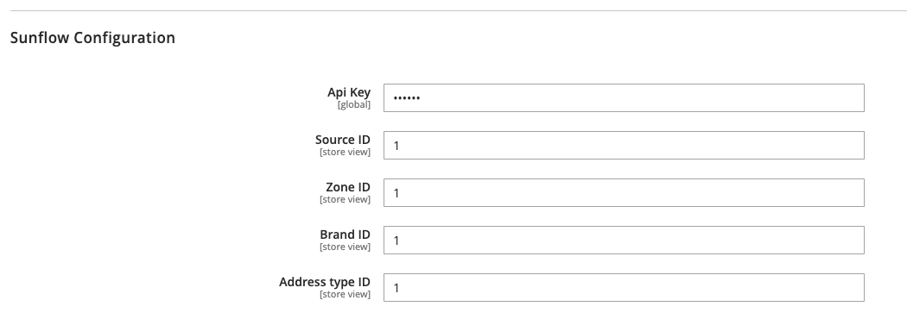
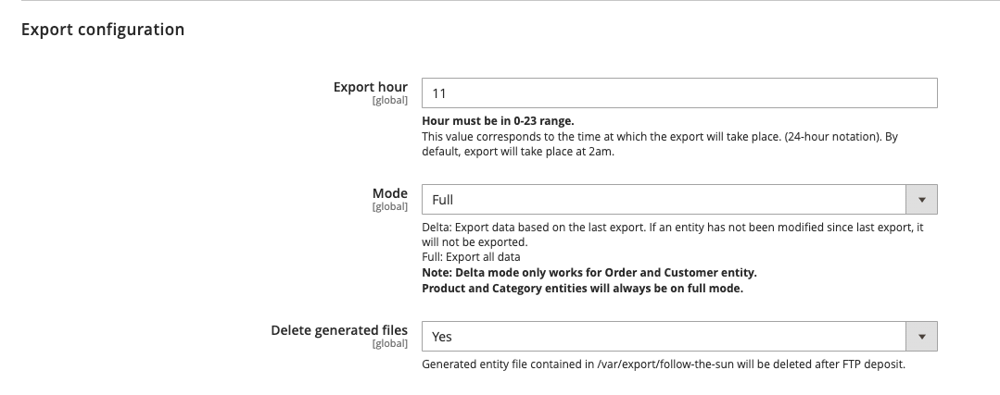
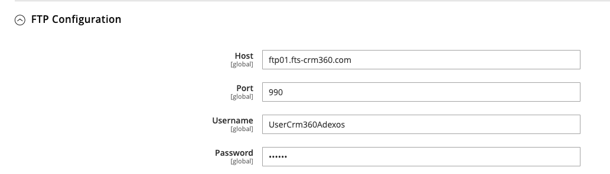
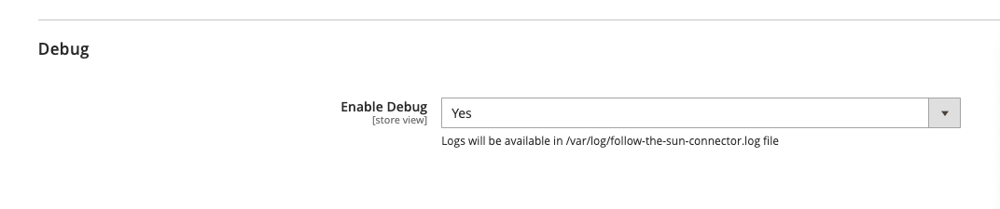

# FollowTheSun 

## Sunflow Magento 2 Connector

### How to install

You can install the Sunflow Magento 2 connector by using composer :

`composer require follow-the-sun/sunflow-magento2-connector`

### Configuration

You can configure the settings through the magento 2 admin by going to : `Sunflow > Configuration`

* In the `Sunflow Configuration` section, you need to configure your API key and some required fields that can be found in your Sunflow interface.


* In the `Export Configuration` section, you can configure export time and mode.

To ensure that the export works correctly, you need to make sure that your Magento 2 `cron:run` command is running frequently.

The mode defines the export behavior :
* If the full mode is enabled, all entity data will be exported.
* If the delta mode is enabled, only modified entity data since the last export will be exported (this works only for Order and Customer entity).


* In the `FTP Configuration` section, you need to configure the FTP information. You can find them in your Sunflow interface.


* A debug mode is available in `Debug` section. Logs will be stored in your `<magento_root>/var/log/follow-the-sun-connector.log` file.


### Available export commands

You can run export command for different entities at anytime :
```
  bin/magento follow-the-sun:export:category        Export Category for Sunflow
  bin/magento follow-the-sun:export:customer        Export Customer for Sunflow
  bin/magento follow-the-sun:export:order           Export Order for Sunflow
  bin/magento follow-the-sun:export:product         Export Product for Sunflow
  bin/magento follow-the-sun:export:product-store   Export Product Store for Sunflow
```
